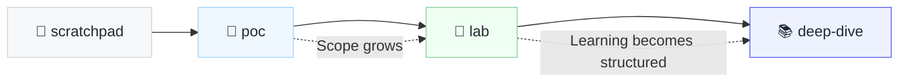

# Repo Conventions

Repository conventions for a clean, intentional, future-proof GitHub.

### Repository Categories

| Intent Type | Description | Key Question |
| ----- | ----- | ----- |
| **deep-dive** *single repo* `deep-dive-*` | Structured, in-depth learning about a technology, focusing on architecture, trade-offs, and real-world usage. | How does this really work? |
| **poc** *single repo* `poc-*` | Proof of concept to validate feasibility or behavior of a technology or approach. | Can this work? |
| **lab** *single repo* `lab-*` | Exploratory experimentation that may evolve, but is not yet fully structured. | How does this behave? |
| **scratchpad** *mono-repo* | Quick experiments, spikes, and throwaway code. ***folder-structure** → data | streaming | orchestration | infra | benchmarks | misc | trash* | What happens if I try this? |
| **archive** *mono-repo* | Frozen, read-only projects preserved for reference. No refactoring, no dependency upgrades, no CI/CD, no active development. | What did this look like at the time? |

### Graduation Rule

### Repository Tags

| Category | Purpose | Tags |
| --- | --- | --- |
| **Identity / Role Tags** | Describe your core professional identity. Used on most repositories. | `data-engineering`, `distributed-systems`, `backend`, `learning` |
| **Identity / Role (Optional)** | Secondary or situational identities. Use only when relevant. | `platform-engineering`, `analytics-engineering` |
| **Repository Intent Tags** | Define *why the repo exists*. Use **exactly one per repository**. | `deep-dive`, `lab`, `poc`, `benchmark`, `scratchpad`, `archive` |
| **Technology Tags** | Concrete tools and technologies actually used in the repo. | `airflow`, `dbt`, `spark`, `flink`, `kafka`, `redpanda`, `duckdb`, `iceberg`, `delta-lake`, `parquet`, `avro`, `terraform`, `docker`, `kubernetes` |
| **Concept Tags** | System-level and architectural concepts demonstrated. | `batch-processing`, `stream-processing`, `event-driven`, `data-modeling`, `schema-evolution`, `query-optimization`, `cost-optimization`, `exactly-once`, `backpressure`, `observability`, `governance` |
| **Status / Lifecycle Tags** | Indicate maturity or maintenance state. Use sparingly. | `experimental`, `deprecated`, `historical-code`, `read-only` |
